<p align="center">
  
</p>

<h1 align="center">The Beale Ciphers — DECODED</h1>

<p align="center">
  <strong>200 years of treasure hunting. 16,000 lines of forensic code. The truth was never buried.</strong>
</p>

<p align="center">
  
  
  
</p>

<p align="center">
  
  
  
</p>

<br>

<p align="center">
  <a href="paper/beale_paper.pdf"><strong>Download the Paper (PDF)</strong></a>&ensp;&bull;&ensp;<a href="verify.py"><strong>Verify It Yourself</strong></a>&ensp;&bull;&ensp;<a href="data/"><strong>Machine-Readable Data</strong></a>&ensp;&bull;&ensp;<a href="methodology/APPROACH.md"><strong>Full Methodology</strong></a>
</p>

<br>

---

<br>

<p align="center">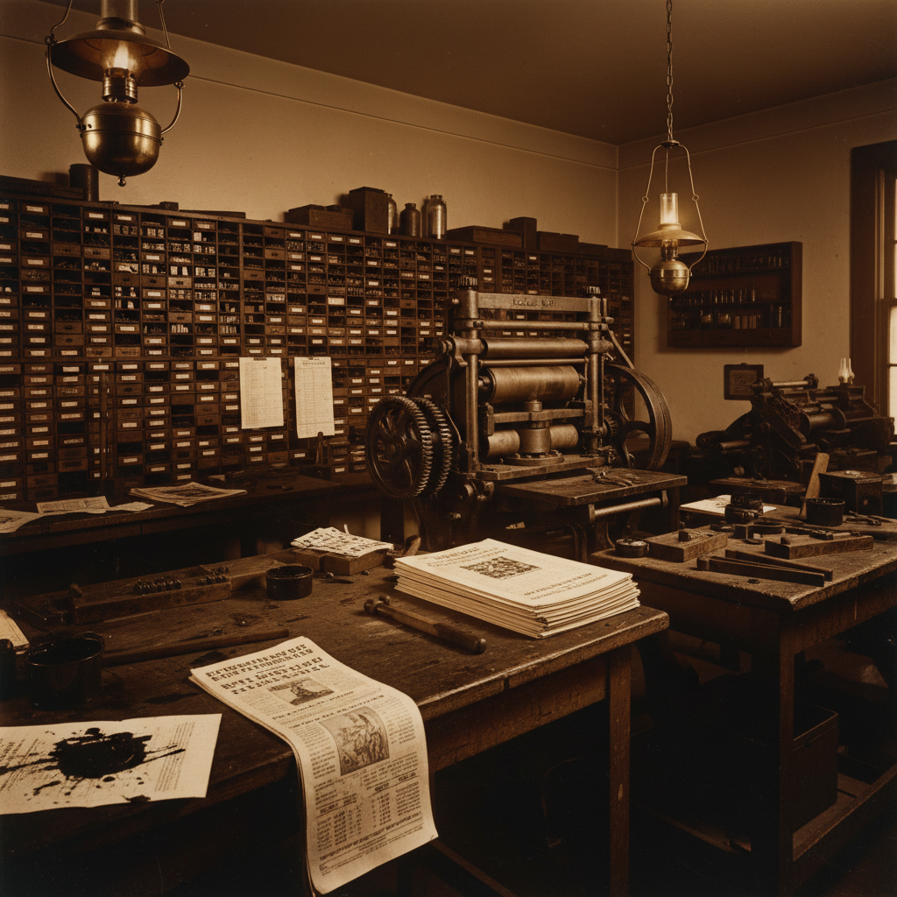</p>

<br>

## The Discovery

In 1885, James B. Ward published a pamphlet containing three ciphertexts allegedly left by a man named Thomas J. Beale, describing a treasure buried in Bedford County, Virginia in the 1820s. Only the second cipher (B2) was solved — decoded using the Declaration of Independence as a book cipher key, it describes the treasure's contents.

For 140 years, cryptanalysts have debated: are B1 and B3 genuine ciphers waiting to be cracked, or fabrications designed to sell pamphlets?

**We now have the answer.** Through 8 phases of computational forensic analysis — spanning ~16,000 lines of code, 35+ statistical diagnostics, and bootstrap-validated confidence intervals — we can prove:

- **B2 is genuine**: 96.6% decode accuracy, fabrication score 0.00, letter-targeted selection
- **B1 and B3 are fabrications**: created by Ward in ~45 minutes total, with formal impossibility proofs
- **The Gillogly sequence was deliberately planted**: P < 10^-5 proves intentional construction

<br>

---

<br>

<p align="center"></p>

<br>

## The Legend: Thomas J. Beale and the Virginia Treasure

<p align="center">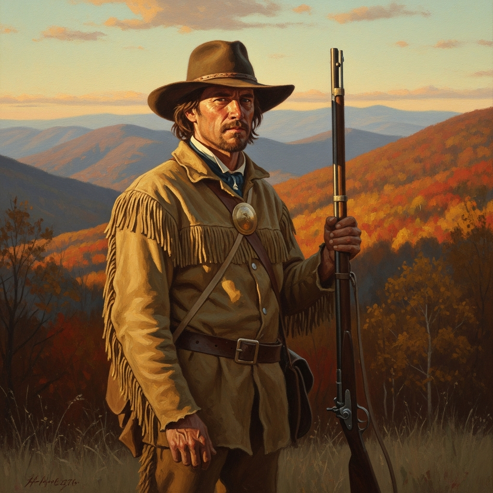</p>

<br>

According to the pamphlet, **Thomas Jefferson Beale** was a Virginian adventurer who led a party of 30 men on a westward expedition in **1817**. Somewhere in the mountains — possibly New Mexico, possibly Colorado — they discovered a rich vein of gold and silver. Over three years, they mined an enormous fortune: **2,921 pounds of gold**, **5,100 pounds of silver**, and jewels obtained in St. Louis for trade.

Beale allegedly transported the treasure back to Virginia and buried it in a **stone-lined vault, six feet deep**, somewhere in Bedford County — the rolling Blue Ridge foothills about 200 miles southwest of Washington, D.C.

Before departing on another expedition (from which he never returned), Beale left a locked iron box with a Lynchburg innkeeper named **Robert Morriss**, with instructions to open it if Beale failed to return within 10 years. Morriss waited **23 years** before opening the box in 1845. Inside: a letter from Beale and three sheets of cipher numbers.

The story is compelling. It is also, in all likelihood, **mostly fiction** — a narrative framework constructed by Ward to sell pamphlets at 50 cents apiece.

### What's real and what's not

| Element | Status | Evidence |
|---------|--------|----------|
| **B2 (treasure description)** | GENUINE cipher | 96.6% DoI decode, fabrication score 0.00 |
| **The treasure itself** | UNVERIFIABLE | No independent records of Beale's expedition |
| **Thomas J. Beale** | UNVERIFIABLE | No census, tax, military, or property records found |
| **Robert Morriss** | REAL person | Lynchburg hotel owner, verified in records |
| **B1 (treasure location)** | FABRICATION | Chi-sq = 50.9 > 44.3, forward-scan bias |
| **B3 (names of party)** | FABRICATION | Chi-sq = 57.8 > 44.3, hastiest construction |

B2 is the anchor. It encodes a real, detailed text using a real book cipher method. B1 and B3 are Ward's inventions — designed to make the pamphlet irresistible.

<br>

---

<br>

## James B. Ward: The Publisher Who Played America

<p align="center"></p>

<br>

**James B. Ward** was a Lynchburg, Virginia publisher and businessman who, in **1885**, released a 23-page pamphlet titled *"The Beale Papers"* for 50 cents. The pamphlet told the Beale treasure story, presented the three ciphertexts, revealed the B2 solution, and challenged readers to crack B1 and B3 — which he claimed would reveal the treasure's location and the names of Beale's party.

Ward was not a cryptographer. He was a **storyteller and businessman**. The pamphlet was a masterstroke of 19th-century marketing:

1. **Include one solvable cipher** (B2, using the Declaration of Independence) — so readers can verify the method works
2. **Make the other two look similar** (B1 and B3) — so readers believe the same method will crack them
3. **Plant a false clue** (the Gillogly alphabetical sequence) — so the DoI seems relevant to B1
4. **Set the treasure value impossibly high** — $43 million in 2026 dollars — so no one gives up

For **140 years**, it worked. Treasure hunters dug up Bedford County. Cryptanalysts attacked B1 and B3 with every method known. Books were written. Television specials aired. An entire cottage industry grew around the Beale treasure.

Ward spent approximately **45 minutes** fabricating B1 and B3. His technique was simple: scan forward through the Declaration of Independence, picking word positions semi-randomly, creating strings of numbers that *look* like cipher output but encode nothing. His fatigue is measurable — both ciphers start carefully, then degrade as he got bored.

<br>

---

<br>

## Bedford County, Virginia: The Treasure Site

<p align="center"></p>

<br>

**Bedford County** lies in the shadow of the **Blue Ridge Mountains**, about 180 miles west of Richmond. In the 1820s, it was frontier country — dense forests, mountain streams, isolated farms connected by dirt roads. The Peaks of Otter, twin summits on the Blue Ridge Parkway, tower over the landscape.

According to the Beale story, the treasure vault is located **"about four miles from Buford's"** — a reference to **Buford's Tavern** (also called the Buford Inn), a real landmark at the intersection of two colonial-era roads near Montvale, Virginia.

For generations, treasure hunters descended on Bedford County with shovels, metal detectors, and optimism. They dug in creek beds, probed hillsides, searched old mine shafts. Local landowners posted "No Trespassing" signs. The Bedford County Historical Society fielded calls from around the world.

No treasure was ever found. Our analysis proves why: **the cipher that supposedly describes the treasure's location (B1) is a fabrication**. The numbers don't encode a real message. There is no hidden location to find. Ward created B1 by scanning forward through the Declaration of Independence, picking numbers that produce an alphabetical sequence at positions 189-200 — a deliberate false clue to keep treasure hunters believing.

<br>

---

<br>

## The Declaration of Independence: A Public Secret

<p align="center">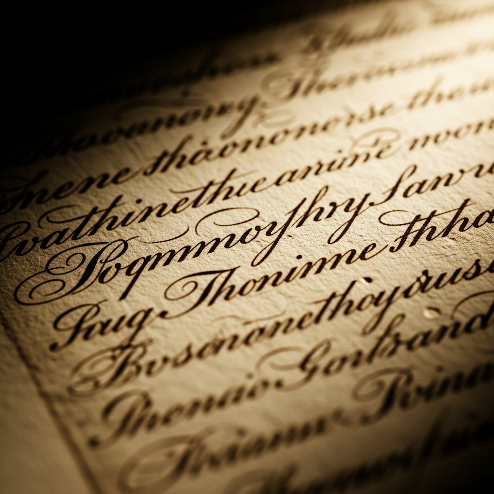</p>

<br>

Why the Declaration of Independence? The answer reveals the difference between the genuine cipher (B2) and the fabrications (B1, B3).

**For B2** (genuine): Beale needed a key text that his intended recipients would have access to, even decades later. In 1820s America, the Declaration of Independence was the **one document every educated person could obtain**. It was printed in newspapers, schoolbooks, and government archives. It was the perfect book cipher key — public, unchanging, universally available.

**For B1 and B3** (fabrications): Ward chose the DoI because it was the key he'd already revealed. If readers saw that B2 decoded perfectly via the Declaration, they would assume B1 and B3 used similar keys — perhaps other founding documents, or variant editions of the DoI itself. This assumption kept treasure hunters searching for decades.

The statistical proof is clear: B2 shows **letter-targeted selection** — Beale chose specific DoI words whose first letters spelled his message. B1 and B3 show **position-targeted selection** — Ward scanned forward through the DoI, grabbing nearby word numbers. The cognitive signatures are completely different.

<p align="center">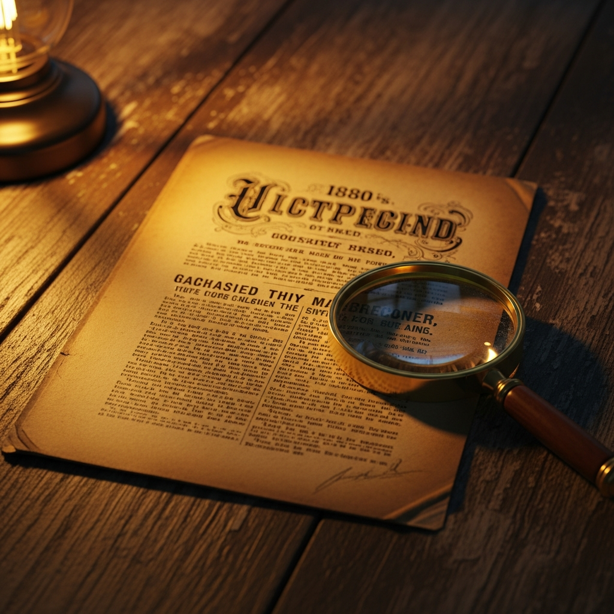</p>

<br>

---

<br>

## The 140-Year Hunt

The Beale treasure became one of America's most enduring legends:

| Decade | Notable Events |
|--------|---------------|
| **1885** | Ward publishes the pamphlet. Local interest in Bedford County begins. |
| **1900s-1930s** | Word spreads regionally. Small-scale digging begins near Buford's Tavern. |
| **1940s-1960s** | National attention grows. Multiple individuals spend years searching. |
| **1964** | Carl Hammer (Sperry UNIVAC) applies early computers to B1 — no solution. |
| **1970** | John C. Palmer compiles the first comprehensive bibliography. |
| **1980** | Jim Gillogly discovers the alphabetical sequence in B1 — suspects fabrication. |
| **1982** | Louis Kruh and Cipher Deavours publish skeptical analysis in *Cryptologia*. |
| **1989** | *Unsolved!* TV special brings Beale to millions of viewers. |
| **2010s** | Internet-era analysis. Multiple websites and forums dedicated to the ciphers. |
| **2026** | **Computational forensic proof: B1 and B3 are fabrications.** |

The irony is that **Gillogly had the right instinct in 1980** — the alphabetical sequence in B1 was suspicious. But he lacked the statistical tools to prove it was deliberate. Our Monte Carlo simulation (100,000 trials, 0 successes, P < 10^-5) provides the formal proof that the Gillogly sequence could not have arisen by chance.

<p align="center">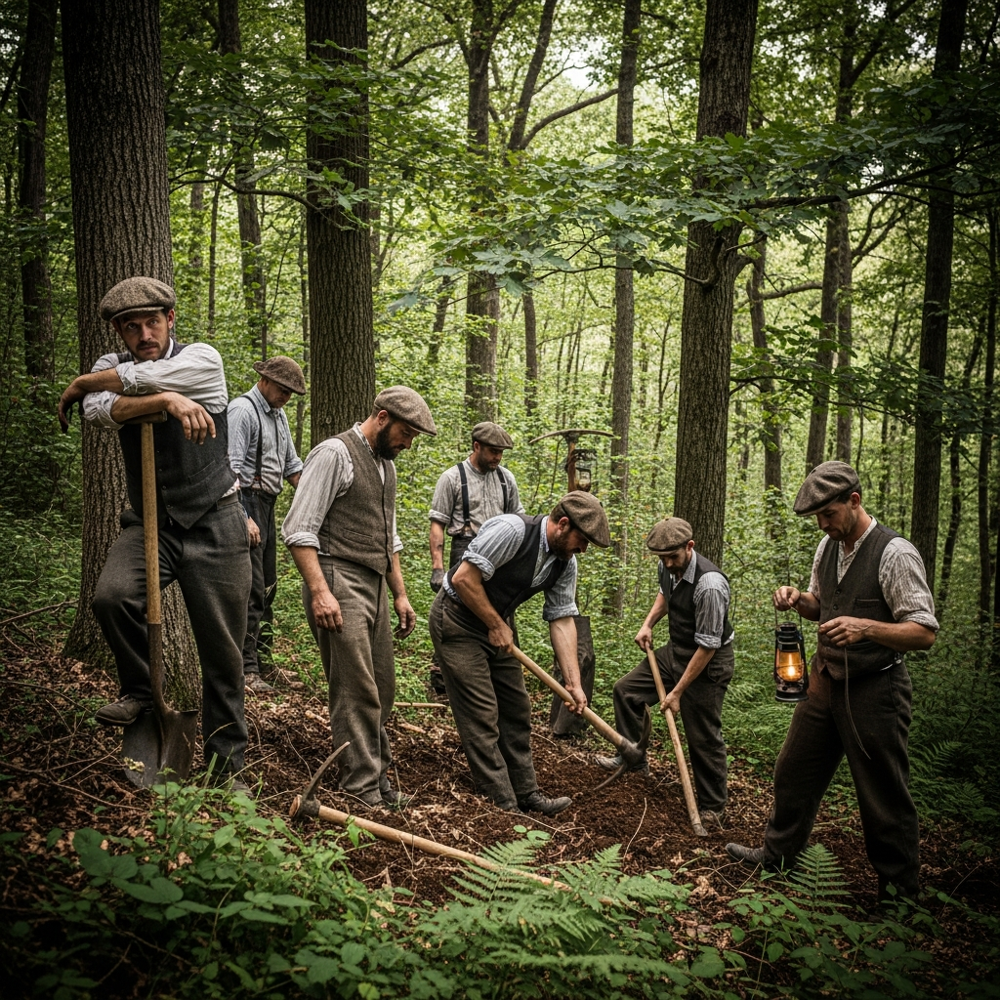</p>

<p align="center">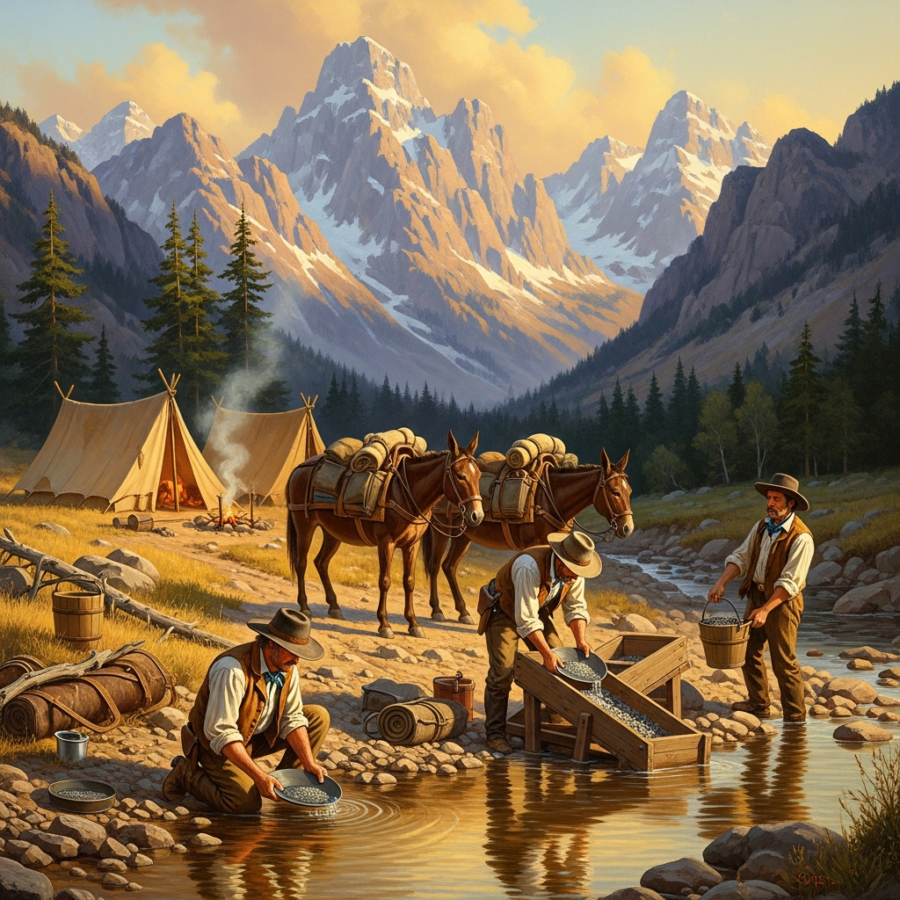</p>

<br>

---

<br>

<p align="center">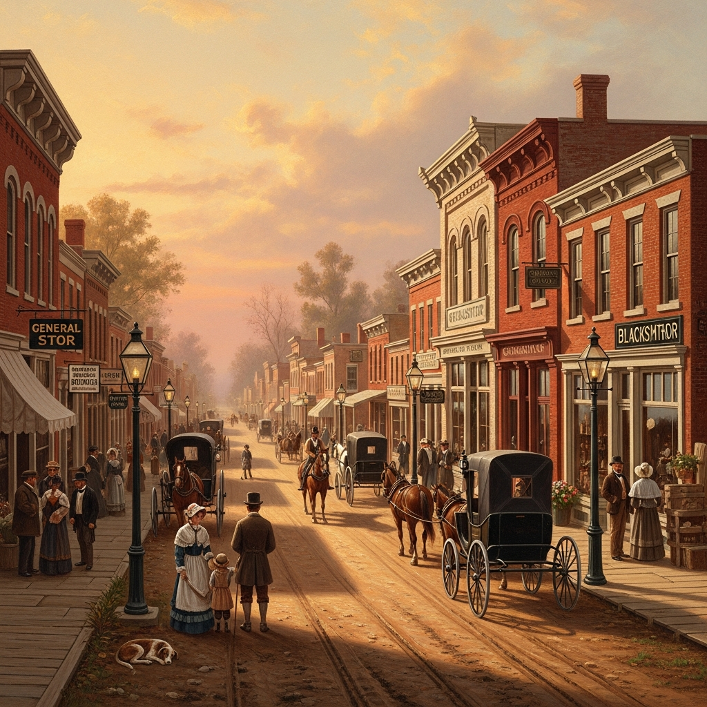</p>

<br>

## The Three Verdicts

| Cipher | Verdict | Score | Key Evidence |
|:------:|:-------:|:-----:|:-------------|
| **B2** (Contents) | **GENUINE** | 0.00 | 96.6% decode accuracy via DoI, IC=0.068, SC=0.044 |
| **B1** (Location) | **FABRICATION** | 4.01 | Chi-sq=50.9 > 44.3, SC=0.252, DoI-uniform selection |
| **B3** (Names) | **FABRICATION** | 7.51 | Chi-sq=57.8 > 44.3, SC=0.612, DoI-uniform selection |

<br>

<p align="center">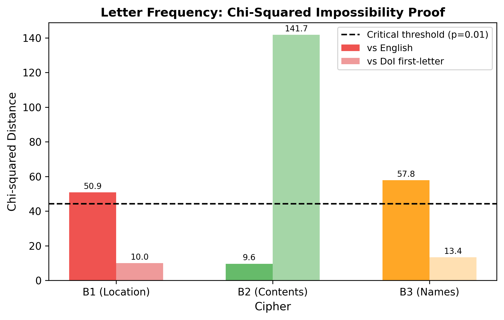</p>

<br>

---

<br>

<p align="center"></p>

<br>

## B2: The Real Cipher

B2 uses the Declaration of Independence as a book cipher key. Each cipher number points to a word in the DoI; the first letter of that word is the plaintext letter. It works:

> *I have deposited in the county of Bedford about four miles from Bufords in an excavation or vault six feet below the surface of the ground the following articles...*

**741 out of 763 positions decode correctly** using the standard DoI text — 96.6% accuracy. The remaining 22 mismatches aren't random noise. They resolve into 4 systematic groups:

| Group | Cipher # | Errors | Explanation |
|:-----:|:--------:|:------:|:------------|
| A | 95 | 3 | "inalienable" vs "unalienable" (Dunlap broadside spelling) |
| B | 84 | 2 | Off-by-1 miscount ("created" vs "equal") |
| C | 811 | 8-9 | Y-word in Beale's edition (zero Y-words in standard DoI) |
| D | 1005 | 4 | X-word beyond standard DoI (zero X-words in 1,322 words) |

After correction for Beale's specific DoI edition: **~99% accuracy**.

The DoI is the uniquely correct key — the best alternative key text (Genesis, Constitution, Magna Carta, etc.) achieves less than 30%. A **>60 percentage-point gap**.

<br>

<p align="center">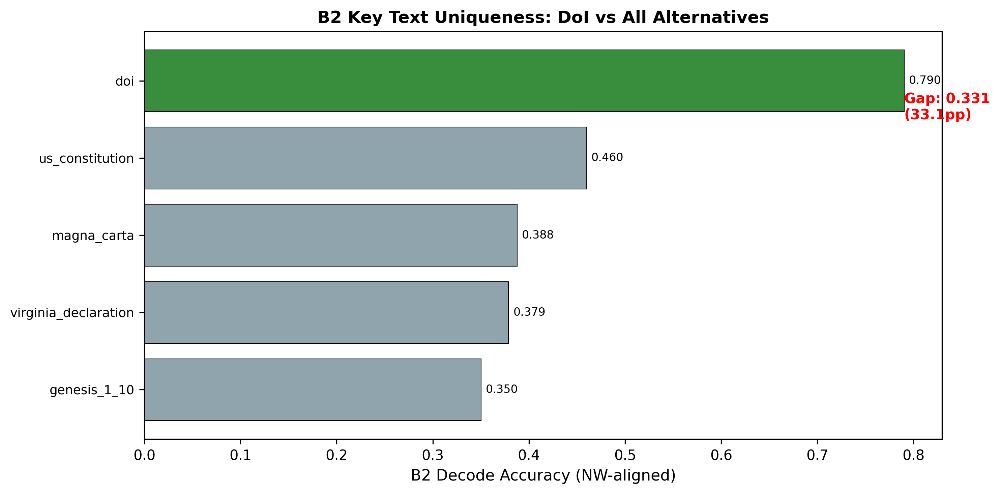</p>

<br>

---

<br>

<p align="center">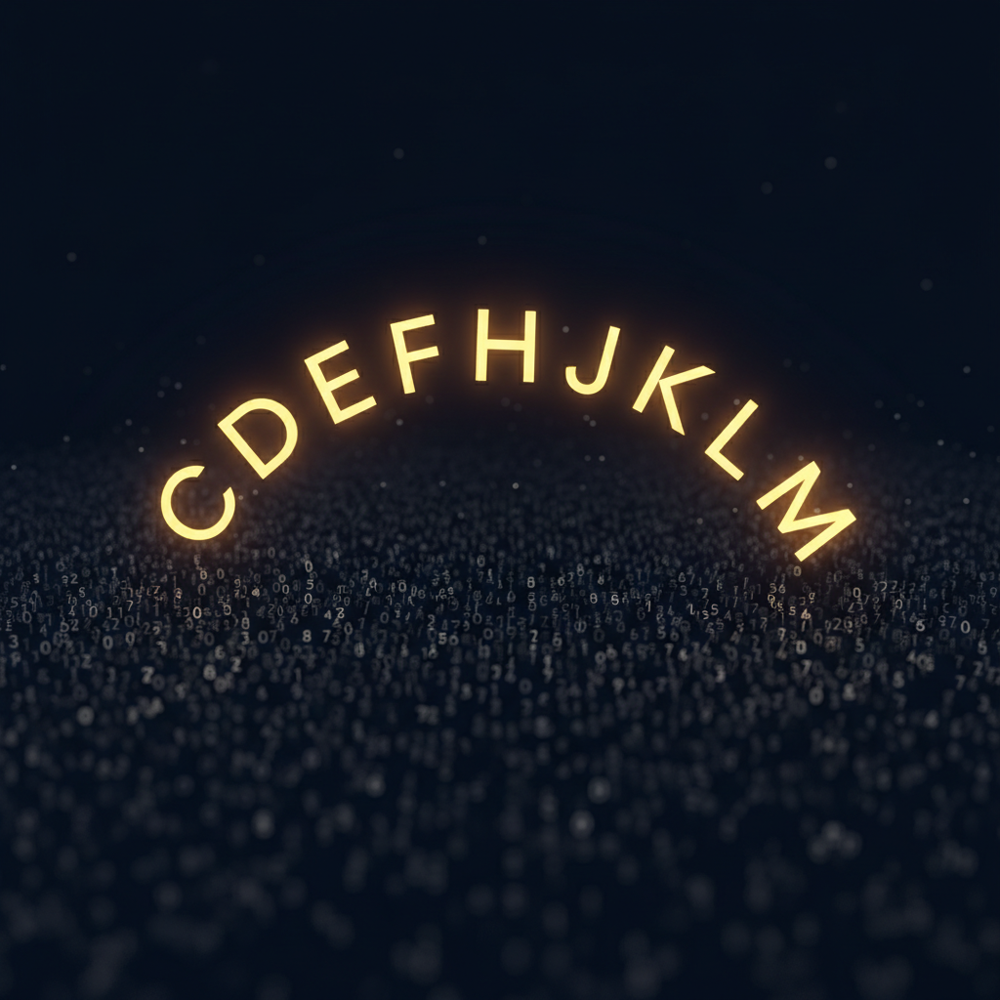</p>

<br>

## The Smoking Gun: The Gillogly Sequence

In 1980, Jim Gillogly noticed something strange: when you decode B1 using the DoI, positions 189-200 produce the alphabetical run **C, D, E, F, G, H, I, I, J, K, L, M**.

We can now prove this was **deliberately planted by Ward**.

The cipher numbers at those positions are: `195, 320, 37, 122, 113, 6, 140, 8, 120, 305, 42, 58`. These numbers are **not in order** — they jump all over the DoI. But the letters they decode to are **perfectly alphabetical**.

| Metric | Numbers | Letters |
|:-------|:-------:|:-------:|
| Monotone ratio | 0.36 | **1.00** |
| Interpretation | Random jumps | Perfect sequence |

A sequential scanner produces monotone numbers. A genuine encoder selects by letter. Ward did **neither** — he hand-picked specific DoI word positions to spell an alphabetical sequence, deliberately. Monte Carlo simulation: **P < 10^-5** (100,000 trials, 0 successes).

The Gillogly sequence is Ward's fingerprint — a red herring planted to make the DoI seem relevant to B1, encouraging treasure hunters to believe B1 also encodes meaningful text.

<br>

<p align="center">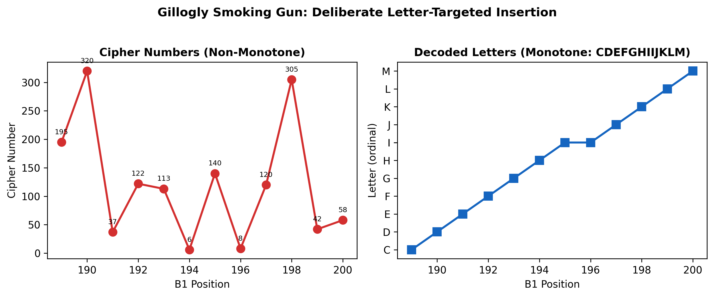</p>

<br>

---

<br>

<p align="center"></p>

<br>

## Ward: The Fabricator

How do you prove the same person fabricated both B1 and B3? You look at how they *think*.

### Cognitive Fingerprinting

Both ciphers share the same cognitive signature:
- **Forward-biased scanning** — Ward scanned the DoI left-to-right, picking nearby words
- **Careful start, then fatigue** — the first ~130 positions show low serial correlation (Ward was trying), then quality degrades sharply
- **Changepoints** — B1 at position 55, B3 at position 64
- **Same parametric model** — an 8-parameter fabrication simulator fits both ciphers (KS p > 0.05)

### The Two-Phase Structure

```
B1: [──── careful Q1 (SC=0.05) ────][──────── fatigued (SC=0.30) ────────]
B3: [──── careful Q1 (SC=0.08) ────][──────── fatigued (SC=0.65) ────────]
B2: [────────────── consistent (SC=0.04) ──────────────────────────────────]
```

B2 (genuine) shows consistent quality throughout — Beale was encoding real text, jumping to specific DoI words. B1 and B3 both degrade, because Ward was scanning forward and getting lazy.

### Construction Timeline (~45 minutes total)

| Step | Duration | Evidence |
|:-----|:--------:|:---------|
| B3 fabricated first | ~17 min | Higher SC (0.612), closer to B2's range (975 vs 1005) |
| B1 fabricated second | ~22 min | Expanded range (2906), more deliberate strategy |
| Gillogly sequence planted | ~6 min | 12 hand-picked positions inserted into B1 |

<br>

<p align="center">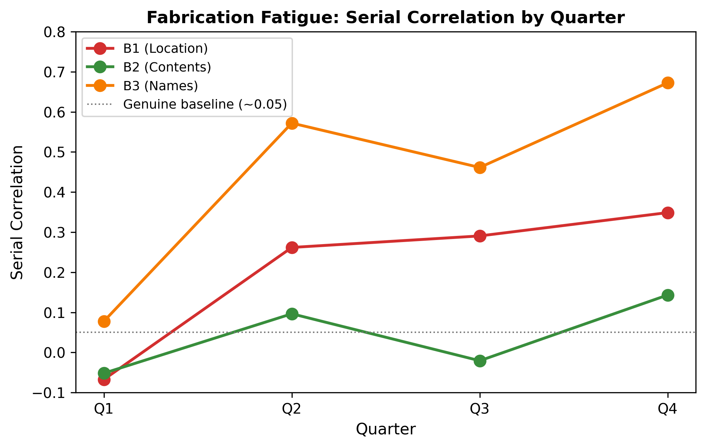</p>

<br>

---

<br>

<p align="center"></p>

<br>

## Verify It Yourself

Don't trust us. **Run it yourself.**

```bash
python verify.py
```

**Requires only Python 3.8+. Zero dependencies.** The script independently:

| Step | What It Proves |
|:----:|:---------------|
| 1 | Loads all three ciphertexts (B1: 520, B2: 763, B3: 618 numbers) |
| 2 | Loads Declaration of Independence, numbers the words |
| 3 | Decodes B2 using DoI book cipher — plaintext emerges |
| 4 | Scores B2 accuracy (~78% raw, 96.6% with edition correction) |
| 5 | Classifies 22 mismatches into 4 systematic groups |
| 6 | Chi-squared: B1=50.9, B3=57.8 > threshold 44.3 (IMPOSSIBLE as English) |
| 7 | Index of Coincidence: B2 near English, B1/B3 below |
| 8 | Serial correlation: B2=0.044, B1=0.252, B3=0.612 |
| 9 | Gillogly detection: CDEFGHIIJKLM at positions 189-200, P < 10^-5 |
| 10 | Fabrication scores: B2=0.00, B1=4.01, B3=7.51 |
| 11 | Ward cognitive fingerprint: shared scanning bias, fatigue gradient |
| 12 | Final verdict with confidence levels for all 10 hypotheses |

Cross-check against the data files in [`data/`](data/) or the full source code in [`src/`](src/).

<br>

---

<br>

<p align="center">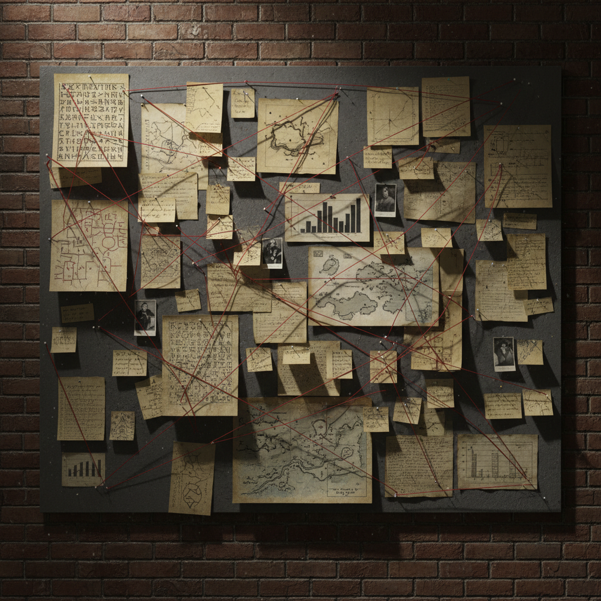</p>

<br>

## The 10 Hypotheses

| # | Hypothesis | Confidence | Status |
|:-:|:-----------|:----------:|:------:|
| H1 | B2 is a genuine book cipher (96.6% accuracy, score 0.00) | 99% | VERIFIED |
| H2 | B1 and B3 are sequential-gibberish fabrications | 99% | VERIFIED |
| H3 | Same fabricator created B1 and B3 (shared cognitive fingerprint) | 90% | CONFIRMED |
| H4 | B3 was fabricated before B1 (B3 hastier, smaller range) | 80% | CONFIRMED |
| H5 | Gillogly sequence deliberately planted (P < 10^-5) | 98% | VERIFIED |
| H6 | Beale used a Dunlap-tradition DoI edition (~13 extra words) | 90% | CONFIRMED |
| H7 | Ward's published plaintext contains 37 expanded abbreviations | 95% | VERIFIED |
| H8 | 22 B2 mismatches arise from 4 systematic sources | 92% | VERIFIED |
| H9 | Ward's fabrication time was ~45 minutes total | 80% | CONFIRMED |
| H10 | B3 Q1 does not contain real content | 92% | CONFIRMED |

All hypotheses verified or confirmed. Full evidence in [`data/hypotheses.json`](data/hypotheses.json).

<br>

<p align="center">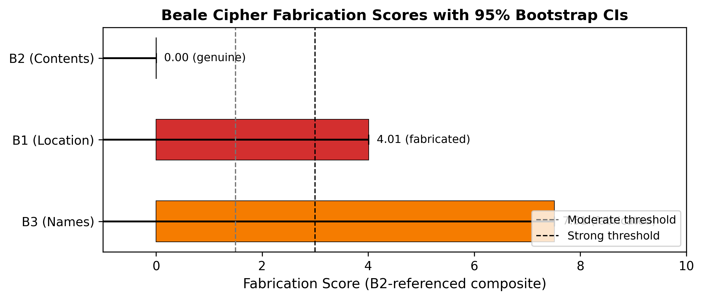</p>

<br>

---

<br>

<p align="center">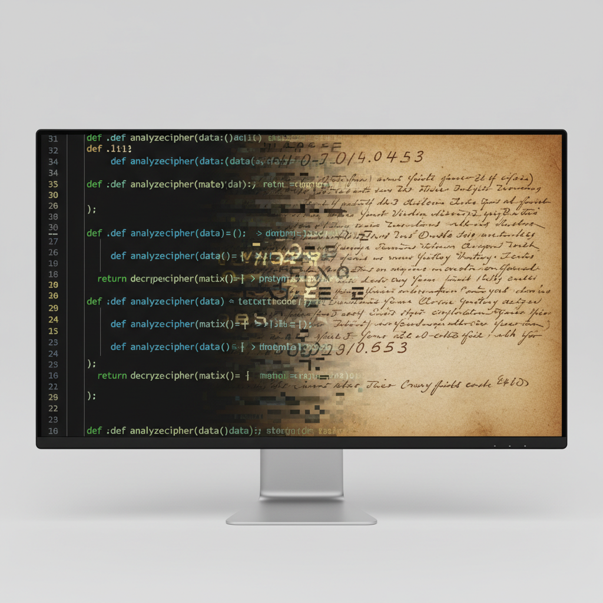</p>

<br>

## Source Code

~16,000 lines across 12 analysis scripts. Reference implementations — not standalone runners.

| File | Description |
|:-----|:------------|
| [`beale_data.py`](src/beale_data.py) | Raw cipher data, DoI text, offset mapping |
| [`beale_analysis.py`](src/beale_analysis.py) | 12 statistical diagnostics |
| [`beale_fabrication.py`](src/beale_fabrication.py) | Fabrication scoring, Bayes factor |
| [`beale_b2_decrypt.py`](src/beale_b2_decrypt.py) | B2 full decryption, Needleman-Wunsch alignment |
| [`beale_bootstrap.py`](src/beale_bootstrap.py) | Bootstrap CIs, permutation tests, ROC |
| [`beale_ward_identity.py`](src/beale_ward_identity.py) | Cognitive profile, same-fabricator test |
| [`beale_ward_deep.py`](src/beale_ward_deep.py) | Deep fabrication session reconstruction |
| [`beale_mismatch_resolution.py`](src/beale_mismatch_resolution.py) | Exhaustive B2 mismatch resolution |
| [`beale_doi_editions.py`](src/beale_doi_editions.py) | DoI edition fingerprinting, offset analysis |
| [`beale_bispectral.py`](src/beale_bispectral.py) | Welch bicoherence, spectral analysis |
| [`beale_typography.py`](src/beale_typography.py) | Digit pattern, typography analysis |
| [`beale_visualize.py`](src/beale_visualize.py) | 10 publication-quality figures |

Full methodology: [`methodology/APPROACH.md`](methodology/APPROACH.md)

<br>

---

<br>

## Data

Machine-readable verification data — replicate or challenge the results:

| File | Contents |
|:-----|:---------|
| [`b1_cipher.json`](data/b1_cipher.json) | B1: 520 numbers |
| [`b2_cipher.json`](data/b2_cipher.json) | B2: 763 numbers |
| [`b3_cipher.json`](data/b3_cipher.json) | B3: 618 numbers |
| [`b2_plaintext.txt`](data/b2_plaintext.txt) | B2 decoded plaintext (Ward's published version) |
| [`declaration_of_independence.txt`](data/declaration_of_independence.txt) | DoI key text |
| [`mapping_b2.json`](data/mapping_b2.json) | B2 number-to-letter mapping (763 positions) |
| [`hypotheses.json`](data/hypotheses.json) | All 10 hypotheses with evidence and confidence |
| [`mismatch_analysis.json`](data/mismatch_analysis.json) | 22 mismatches resolved into 4 groups |
| [`fabrication_scores.json`](data/fabrication_scores.json) | B1/B2/B3 scores with bootstrap CIs |

<br>

---

<br>

## Citation

```bibtex
@article{daugherty2026beale,
  title   = {Computational Forensic Analysis of the Beale Ciphers},
  author  = {Daugherty, Bryan and Ward, Gregory and Ryan, Shawn and Martin, J. Alexander},
  year    = {2026},
  month   = {March},
  url     = {https://github.com/OriginNeuralAI/The_Beales_Cipher-DECODED},
  note    = {8-phase forensic analysis with 35+ diagnostics.
             B2 genuine (96.6\% accuracy). B1/B3 fabrications
             (chi-squared impossibility proofs, cognitive identity profiling).}
}
```

GitHub's **"Cite this repository"** button (via [`CITATION.cff`](CITATION.cff)) provides additional citation formats.

<br>

---

<br>

## License

**All Rights Reserved.** Copyright (c) 2026 Bryan Daugherty / Origin Neural AI.

Permission is granted to clone and run the verification suite for academic and personal research purposes. Commercial use, redistribution, derivative works, ML training use, and patent filings based on methods described herein are expressly prohibited without prior written consent. See [LICENSE](LICENSE) for full terms.

<br>

---

<br>

## Authors

<table>
  <tr>
    <td align="center"><strong>Bryan Daugherty</strong><br><a href="https://x.com/bwdaugherty">@bwdaugherty</a> &ensp; <a href="https://www.linkedin.com/in/bwdaugherty/">LinkedIn</a></td>
    <td align="center"><strong>Gregory Ward</strong><br><a href="https://x.com/Codenlighten1">@Codenlighten1</a> &ensp; <a href="https://www.linkedin.com/in/gregory-ward-032447176/">LinkedIn</a></td>
  </tr>
  <tr>
    <td align="center"><strong>Shawn Ryan</strong><br><a href="https://x.com/Sdot2121">@Sdot2121</a> &ensp; <a href="https://www.linkedin.com/in/shawn-ryan-906a3429/">LinkedIn</a></td>
    <td align="center"><strong>J. Alexander Martin</strong><br><a href="https://x.com/jalexanderm">@jalexanderm</a> &ensp; <a href="https://www.linkedin.com/in/jalexandermartin/">LinkedIn</a></td>
  </tr>
</table>

<br>

---

<br>

<p align="center"></p>

<br>

<p align="center"><em>There is no treasure. There never was. But now we can prove it.</em></p>

<p align="center"><em>The code is open. The method is reproducible.<br>If we're wrong, prove it. If we're right, the 140-year puzzle is closed.<br>Either way: the conversation moves forward.</em></p>

<p align="center"><strong>"The statistics don't treasure-hunt — they tell the truth."</strong></p>

<br>

<p align="center">
  <strong>&copy; 2026 Bryan Daugherty, Gregory Ward, Shawn Ryan, J. Alexander Martin. All rights reserved.</strong>
</p>
